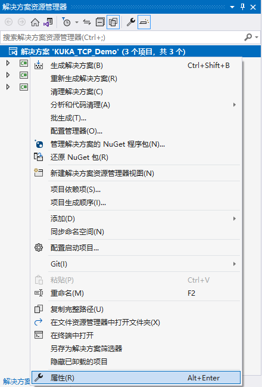
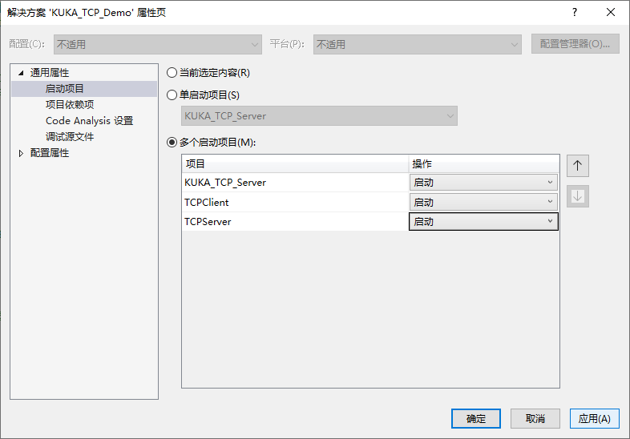
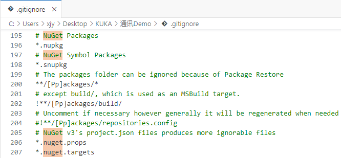
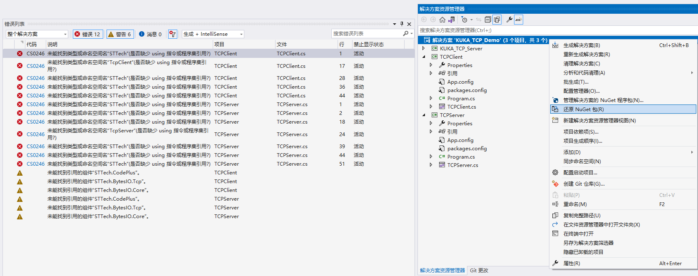

# KUKA库卡机械臂通讯测试Demo

* 解决方案名称为 `KUKA_TCP_Demo.sln`。解决方案下包含三个项目：`TCPServer`、`TCPClient` 和 `KUKA_TCP_Server`，其中前两个项目为基于 **BytesIO TCP** 通讯库的测试项目，可以用于测试 KUKA 机械臂通讯 Demo；而 `KUKA_TCP_Server` 是基于 TCP/IP 协议簇、使用 Socket 接口、采用 XML 结构传输数据的库卡机械臂通讯测试项目。

## 欢迎访问本仓库相关[博客](https://blog.csdn.net/YMGogre/article/details/127792826)！

### 如果您需要测试 KUKA 机械臂通讯 Demo 功能是否正常，请前往[这里](./doc/KUKA%E9%80%9A%E8%AE%AFDemo%E6%B5%8B%E8%AF%95%E6%89%8B%E5%86%8C.md)。

### 如果您想要测试将外部程序配置为服务端，机器人控制系统配置为客户端，请前往[这里](./doc/%E5%A4%96%E9%83%A8%E7%A8%8B%E5%BA%8F%E4%B8%BA%E6%9C%8D%E5%8A%A1%E7%AB%AF-%E6%9C%BA%E5%99%A8%E4%BA%BA%E6%8E%A7%E5%88%B6%E7%B3%BB%E7%BB%9F%E4%B8%BA%E5%AE%A2%E6%88%B7%E7%AB%AF.md)。

### 如果您想要测试将外部程序配置为客户端，机器人控制系统配置为服务端，请前往[这里](./doc/%E5%A4%96%E9%83%A8%E7%A8%8B%E5%BA%8F%E4%B8%BA%E5%AE%A2%E6%88%B7%E7%AB%AF-%E6%9C%BA%E5%99%A8%E4%BA%BA%E6%8E%A7%E5%88%B6%E7%B3%BB%E7%BB%9F%E4%B8%BA%E6%9C%8D%E5%8A%A1%E7%AB%AF.md)

### ⚠️ [其它注意事项](#AnchorPoint-MattersNeedAttention)

### [Q&A](#AnchorPoint-Q&A)

---

<a id="AnchorPoint-MattersNeedAttention">

# 其他注意事项

## 📌 按照 XPath 架构配置

> 使用 XML 进行数据交换时，交换的 XML 文件必须按照相同架构构建。Ethernet KRL 使用 [XPath](https://www.runoob.com/xpath/xpath-tutorial.html) 语言描述和读取 XML 文件。

1. 对于 EKI 来说，用于**发送**和**接收**数据的 XML 结构<font color="#ff4500">**必须拥有[根元素](https://www.runoob.com/xml/xml-syntax.html)**</font>：

    > ✔️ 您可以像这样配置用于数据接收的 XML 结构：
    > 
    > ```xml
    > <RECEIVE>
    >   <XML>
    >       <ELEMENT Tag="Ext/Str" Type="STRING"/>
    >       <ELEMENT Tag="Ext/Pos/XPos" Type="REAL"/>
    >   </XML>
    > </RECEIVE>
    > ```
    >
    > ✔️ 对应接收的 XML 结构可以像这样：
    >
    > ```xml
    > <Ext>
    >   <Str>Text</Str>
    >   <Pos>
    >       <XPos>1.23</XPos>
    >   </Pos>
    > </Ext>
    >
    > <!-- 这里笔者为了便于阅读用了换行和缩进，实际上接收的 XML 结构是一个从头到尾连在一起的字符串。后面也是如此。 -->
    > ```
    >
    > 显然，上方实例中 `Ext` 就是根元素。

    ---

    > ❌ 您不能像这样配置用于数据接收的 XML 结构：
    > 
    > ```xml
    > <RECEIVE>
    >   <XML>
    >       <ELEMENT Tag="Str" Type="STRING"/>
    >       <ELEMENT Tag="Pos/XPos" Type="REAL"/>
    >   </XML>
    > </RECEIVE>
    > ```
    >
    > ❌ 对应接收的 XML 结构不可以像这样：
    >
    > ```xml
    > <Str>Text</Str>
    > <Pos>
    >   <XPos>1.23</XPos>
    > </Pos>
    > ```
    >
    > 显然，上方实例中没有根元素，这不是一个有效的 XML 结构。

2. 对于 EKI 来说，用于**发送**和**接收**数据的 XML 结构<font color="#ff4500">**不能只有根元素**</font>（这与一般的 XML 文档要求似乎不同）：

    > ❌ 您不能像这样配置用于数据接收的 XML 结构：
    > 
    > ```xml
    > <RECEIVE>
    >   <XML>
    >       <ELEMENT Tag="Str" Type="STRING"/>
    >   </XML>
    > </RECEIVE>
    > ```
    >
    > ❌ 对应接收的 XML 结构不可以像这样：
    >
    > ```xml
    > <Str>Text</Str>
    > ```

## 📌 EKI 发送和接收数据

1. 通过 XML 结构通讯时，KRL 程序可用 `EKI_Send()` 发送下列数据：

    * [完整的 XML 结构](#AnchorPoint-KrlSendFullXml)
    * [XML 结构的一部分](#AnchorPoint-KrlSendPartXml)
    * [可变长度的任意字符串](#AnchorPoint-KrlSendString)

2. 通过 XML 结构通讯时，上位机程序可发送下列数据：

    * [完整的 XML 结构](#AnchorPoint-PcSendFullXml)
    * [XML 结构的一部分](#AnchorPoint-PcSendPartXml)

### 示例：

<a id="AnchorPoint-KrlSendFullXml">

**KRL 程序发送完整的 XML 结构**：

* 保存的用于发送数据的 XML 结构：

    ```xml
    <Robot>
        <ActPos X="1000.12"></ActPos>
        <Status>12345678</Status>
    </Robot>
    ```

* KRL 程序：

    ```
    DECL EKI_STATUS RET
    ; 假设配置文件名为“Channel_1.xml”
    RET=EKI_Send("Channel_1","Robot")
    ```

* 发送的 XML 结构：

    ```xml
    <Robot>
        <ActPos X="1000.12"></ActPos>
        <Status>12345678</Status>
    </Robot>
    ```

<a id="AnchorPoint-KrlSendPartXml">

**KRL 程序发送 XML 结构的一部分**：

* 保存的用于发送数据的 XML 结构：

    ```xml
    <Robot>
        <ActPos X="1000.12"></ActPos>
        <Status>12345678</Status>
    </Robot>
    ```

* KRL 程序：

    ```
    DECL EKI_STATUS RET
    ; 假设配置文件名为“Channel_1.xml”
    RET=EKI_Send("Channel_1","Robot/ActPos")
    ```

* 发送的 XML 结构：

    ```xml
    <Robot>
        <ActPos X="1000.12"></ActPos>
    </Robot>
    ```

<a id="AnchorPoint-KrlSendString">

**KRL 程序发送可变长度的任意字符串**：

* 保存的用于发送数据的 XML 结构（直接发送字符串时不使用）：

    ```xml
    <Robot>
        <ActPos X="1000.12"></ActPos>
        <Status>12345678</Status>
    </Robot>
    ```

* KRL 程序：

    ```
    DECL EKI_STATUS RET
    ; 假设配置文件名为“Channel_1.xml”
    RET=EKI_Send("Channel_1","<POS><XPOS>1</XPOS></POS>")
    ```

* 发送的字符串：

    ```xml
    <POS><XPOS>1</XPOS></POS>
    ```

---

<a id="AnchorPoint-PcSendFullXml">

**上位机程序发送完整的 XML 结构**

* 保存的用于发送数据的 XML 结构：

    ```xml
    <Ext>
        <Str>Text</Str>
        <Pos>
            <XPos>1.23</XPos>
        </Pos>
    </Ext>
    ```

* 上位机程序代码：

    ```c#
    //略...
    ```

* 发送的 XML 结构：

    ```xml
    <Ext>
        <Str>Text</Str>
        <Pos>
            <XPos>1.23</XPos>
        </Pos>
    </Ext>
    ```

<a id="AnchorPoint-PcSendPartXml">

**上位机程序发送 XML 结构的一部分**

* 保存的用于发送数据的 XML 结构：

    ```xml
    <Ext>
        <Str>Text</Str>
        <Pos>
            <XPos>1.23</XPos>
        </Pos>
    </Ext>
    ```

* 上位机程序代码：

    ```c#
    //略...
    ```

* 可发送的 XML 结构：

    ```xml
    <Ext>
        <Str>Text</Str>
    </Ext>
    ```

    或者

    ```xml
    <Ext>
        <Pos>
            <XPos>1.23</XPos>
        </Pos>
    </Ext>
    ```

---

<a id="AnchorPoint-Q&A">

# Q&A

## Q：Visual Studio 如何同时运行多个项目

**A1：** 

1. 在解决方案资源管理器中，右击解决方案节点，然后选择“属性”；<br>
2. 展开“通用属性”节点，然后选择“启动项目”，选择“多个启动项目”选项并设置适当的操作。然后点击应用；<br>

**A2：** 或者更简单的，打开多个 Visual Studio 就好啦~

## Q：CS0246 未能找到类型或命名空间名为"STTech"(是否缺少 using 指令或程序集引用?)

**A：**

这是因为 `.gitignore` 文件中添加了对 Nuget 程序包的忽略规则，通常这是正常的。[这样可以减小仓库的大小，并且可以确保每个人都使用相同版本的程序包](https://learn.microsoft.com/zh-cn/nuget/consume-packages/package-restore)。<br>

1. 在“[解决方案资源管理器](https://learn.microsoft.com/zh-cn/visualstudio/ide/use-solution-explorer?view=vs-2022)”中右击解决方案，选择【还原 Nuget 包】：<br>
2. 还是右击解决方案，选择【重新生成解决方案】即可。
3. 如果项目还是无法成功生成，请参考[博客](https://blog.csdn.net/YMGogre/article/details/127792826)中提供的解决办法。