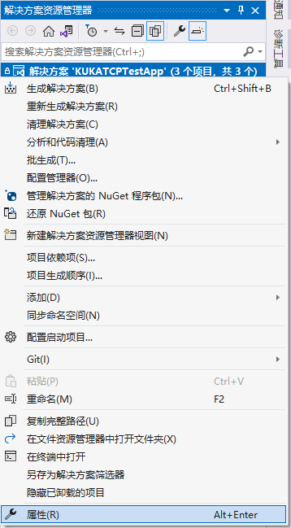

# KUKA库卡机械臂通讯测试Demo
* 解决方案名称为《KUKATCPTestApp》，放在 WindowsFormsTCPClientApp 文件夹下。解决方案下包含三个项目：《WindowsFormsTCPServerApp》、《WindowsFormsTCPClientApp》、《WindowsFormsKRLTCPServerApp》，其中前两个项目为基于 BytesIO TCP 通讯库的测试项目，可以用于测试机械臂通讯 Demo；而 WindowsFormsKRLTCPServerApp 是基于 TCP/IP 协议簇、使用 Socket 接口、采用 XML 结构传输数据的库卡机械臂通讯测试项目。
1. 在项目文件夹下的 bin/debug 目录下打开应用程序：

    
    
    > ⚠️ 如果您是通过 [Github](https://github.com/YMGogre/KUKATCPCommunicationDemo.git)/[Gitee](https://gitee.com/YMGogre/KUKATCPCommunicationDemo.git) 下载的 Demo，则不会有可执行应用程序；需要您在 Visual Studio 中打开 Demo 项目并自行构建。

2. 配置服务端 IP 地址与端口号，服务端的 IP 地址和端口号需要与客户端设置的主机 IP 地址和端口号一致：

    
    > 服务器端的IP地址和端口号在未开始监听的情况下可双击修改，修改后按Enter确认（***必须按Enter确认键后才算修改成功***），开始监听后不再能修改

3. WindowsFormsKRLTCPServerApp 作为 TCP 服务端监听连接，开始监听后可在客户端点击连接，连接成功后日志框弹出提示：

    

4. KRL_TCP 服务端按照配置好的 XML 文件格式输入要发送的信息：

    

5. 点击"发送"，两边日志栏会有相应提示：

    

6. 以上是通过 Demo 中自带的客户端测试程序来测试库卡机械臂通讯上位机的。在实际上位机与机械臂通讯测试时可以通过机械臂示教器查看变量的值确定发送是否成功(***机械臂那边别忘了要先在系统文件 $CONFIG.DAT 声明全局变量Nmb***)：

    

7. 记住一点：上位机发的始终只是字符串！比如上位机想发整数10，实际上发过去的也只是字符"1"和"0"过去。至于机械臂那边想怎么解析它完全是看 xml 配置文件里是如何配置的。

# Q&A

## Q：Visual Studio 如何同时运行多个项目

**A1：** 
1. 在解决方案资源管理器中，右击解决方案节点，然后选择“属性”； 
2. 展开“通用属性”节点，然后选择“启动项目”，选择“多个启动项目”选项并设置适当的操作。然后点击应用； 

**A2：** 或者更简单的，打开多个 Visual Studio 就好啦~