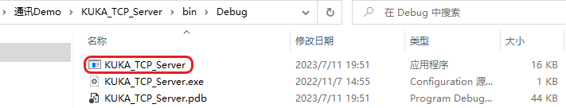
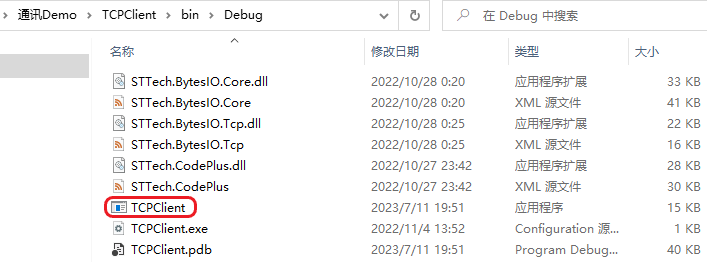
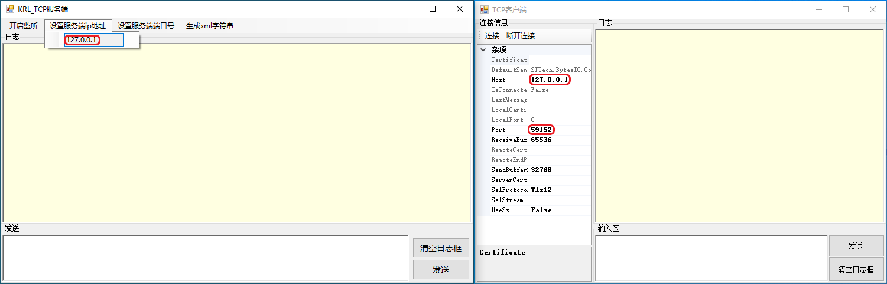
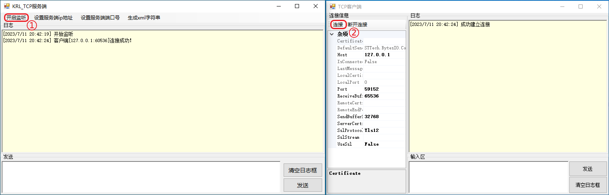
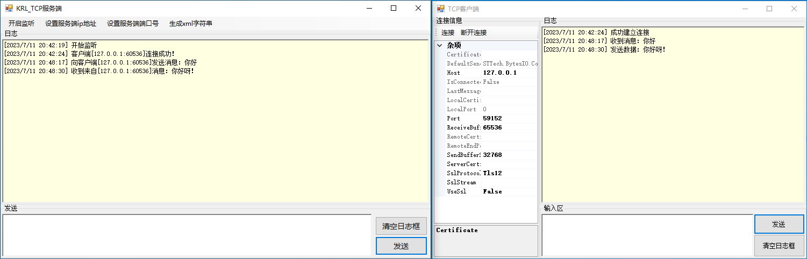

1. 首先前往 `KUKA_TCP_Server` 和 `TCPClient` 项目文件夹下的 *bin/debug* 目录下启动应用程序：

    

    

    > ⚠️ 如果您是通过 [Github](https://github.com/YMGogre/KUKATCPCommunicationDemo.git)/[Gitee](https://gitee.com/YMGogre/KUKATCPCommunicationDemo.git) 下载的 Demo，则不会有可执行应用程序；需要您在 Visual Studio 中打开解决方案并自行构建。

2. 配置服务端 IP 地址与端口号，客户端设置的主机 IP 地址和端口号需要与服务端配置的 IP 地址和端口号一致：

    > 💬 这里我们只是检测通信功能是否正常，双方应用程序在同一主机上运行，故服务端配置 IP 地址为[环回地址](https://cn.bing.com/search?q=%e7%8e%af%e5%9b%9e%e5%9c%b0%e5%9d%80&qs=HS&sk=HS2&sc=10-0&cvid=841CED65B21545759C18B236731A4A75&FORM=QBRE&sp=3&lq=0)即可。

    

    > 服务器端的 IP 地址和端口号在未开始监听的情况下可双击修改，修改后按 Enter 确认（***必须按 Enter 确认键后才算修改成功***），开始监听后不再能修改

3. `KUKA_TCP_Server` 作为 TCP 服务端监听连接，开始监听后可在客户端点击连接，连接成功后日志框弹出提示：

    

4. 双方可以任意编辑文本并发送，双方的日志栏都会有相应提示：

    

5. 以上是通过 Demo 中自带的客户端测试程序来测试库卡机械臂通讯上位机。如果测试没有问题的话，您就可以尝试使用 [`KUKA_TCP_Server`](./%E5%A4%96%E9%83%A8%E7%A8%8B%E5%BA%8F%E4%B8%BA%E6%9C%8D%E5%8A%A1%E7%AB%AF-%E6%9C%BA%E5%99%A8%E4%BA%BA%E6%8E%A7%E5%88%B6%E7%B3%BB%E7%BB%9F%E4%B8%BA%E5%AE%A2%E6%88%B7%E7%AB%AF.md) 或者 [`TCPClient`](./%E5%A4%96%E9%83%A8%E7%A8%8B%E5%BA%8F%E4%B8%BA%E5%AE%A2%E6%88%B7%E7%AB%AF-%E6%9C%BA%E5%99%A8%E4%BA%BA%E6%8E%A7%E5%88%B6%E7%B3%BB%E7%BB%9F%E4%B8%BA%E6%9C%8D%E5%8A%A1%E7%AB%AF.md) 与 KUKA 机械臂进行通信了。
6. 记住一点：上位机发的始终只是 XML 字符串（纯文本格式）！比如上位机想发整数10，实际上发过去的也只是字符"1"和"0"过去。至于机械臂那边想怎么解析它完全是看 xml 配置文件里是如何配置的。[了解更多](https://www.runoob.com/xml/xml-usage.html)