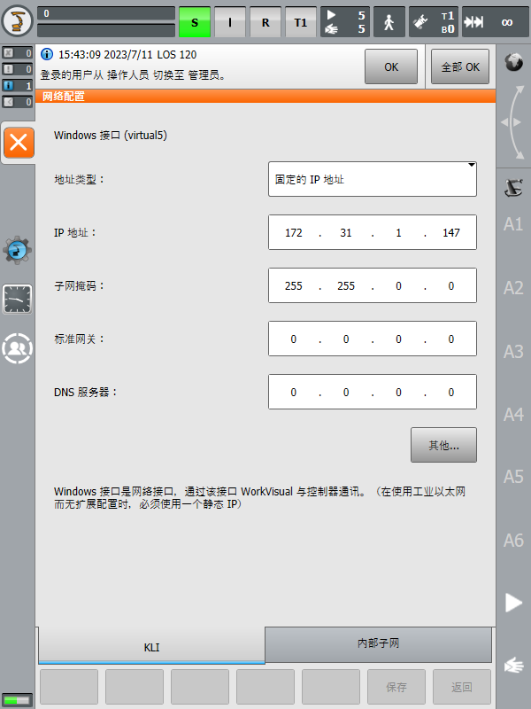
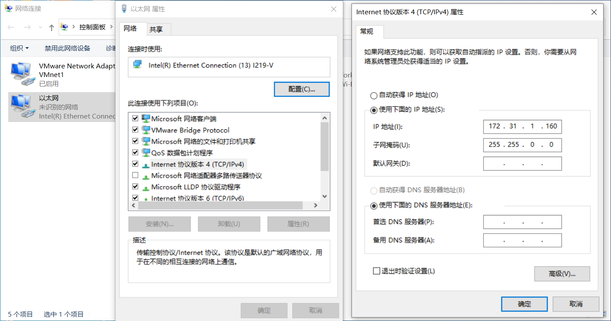
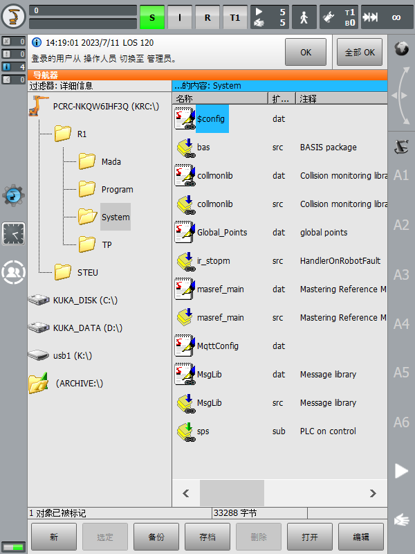
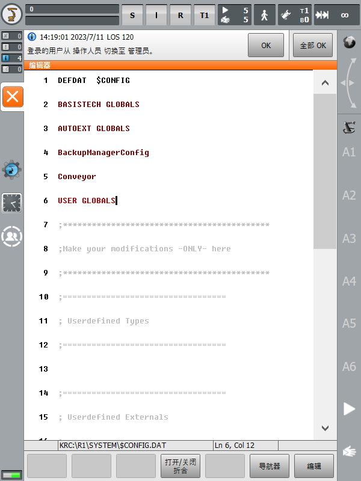
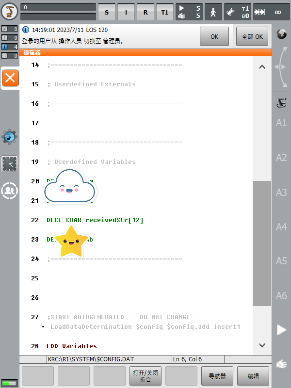
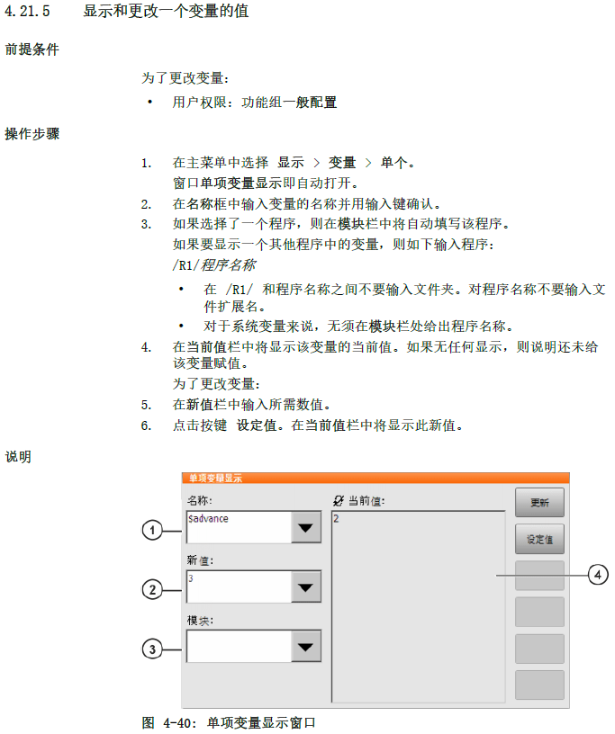

# 网络配置

1. 首先，您需要确保上位机所在的计算机网口与机器人控制柜网口已经通过网线建立了物理上的连接。
2. 在机器人示教器上，在确保权限足够的情况下前往【**主菜单**】-【**投入运行**】-【**网络配置**】以查看机器人控制柜的 IP 地址：<br>

    > 以图片中为例：控制柜的 IP 地址为：`172.31.1.147`

3. 回到上位机所在的计算机，前往【**打开“网络和 Internet 设置”**】-【**更改适配器选项**】，找到刚刚建立的以太网连接。右击后点击【**属性**】-【**Internet 协议版本 4 (TCP/IPv4)**】-【**属性**】，修改计算机的 IP 地址和子网掩码以确保计算机和机器人控制柜处于[同一网段](https://cn.bing.com/search?q=%E5%90%8C%E4%B8%80%E7%BD%91%E6%AE%B5&form=ANNTH1&refig=7539fc3172534b49be0dc1bc06c84c99)（不熟悉这一步骤的同学可以参考[这篇博客](https://blog.csdn.net/w345558033/article/details/108007848)）：<br>

    > 以图片中为例：计算机的 IP 地址为：`173.31.1.160`，子网掩码与机器人控制柜保持一致。您可以使用 `ping` 命令诊断连接，比如：

    ```shell
    ping 172.31.1.147
    ```

# 机器人控制系统声明全局变量

> 💬 在 Demo 中，为了方便调试，我们将会使用全局变量查看机器人控制系统收到的数据。所以在那之前，我们需要先声明全局变量。

1. 在机器人示教器上，前往如下位置找到系统文件 `$CONFIG.DAT`，点击下方的“打开”：<br>
2. 找到第 6 行 `USER GLOBALS` 折合代码，点击下方的“打开/关闭折合”：<br>
3. 来到 `Userdefined Variables`，在其中使用 `DECL CHAR receivedStr[12]` 语句声明一个名为 `receivedStr` 的全局字符数组变量：<br>

<a id="AnchorPoint-ShowVariableValue">

# 显示和更改一个变量的值


> 🔔 以 Demo 为例，我们需要在 KRL 程序运行过程中显示 `receivedStr` 全局变量的值，那么在**名称**框中我们需要输入变量的名称：<font color="#ff4500">**`receivedStr[]`**</font>。