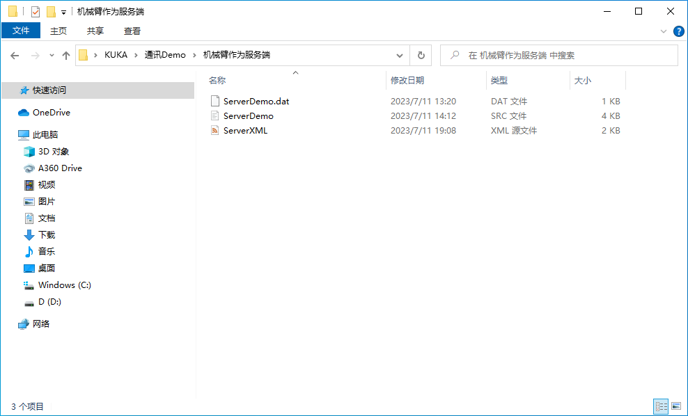
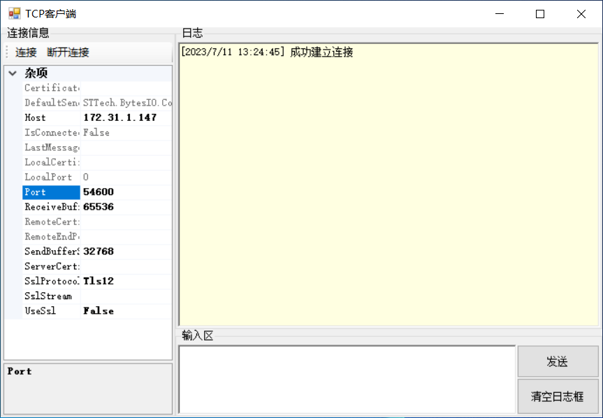
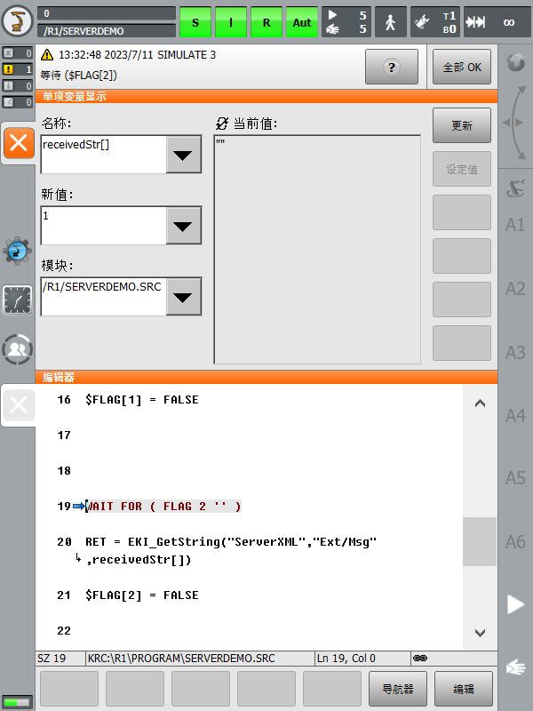
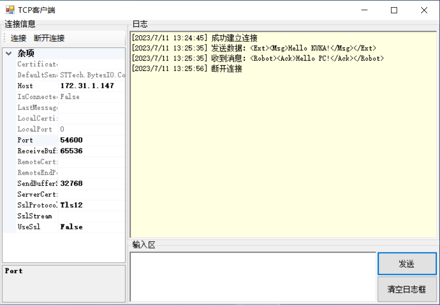
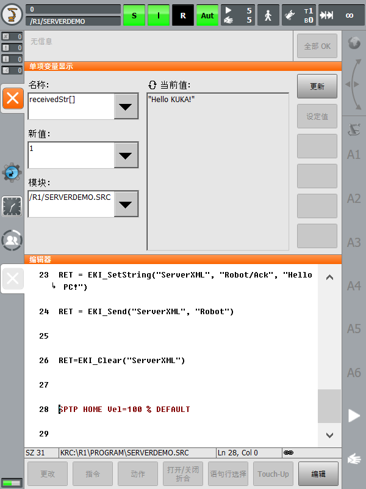

# 0、先决条件

在开始本教程之前，您需要确保您已经完成了[准备工作](./%E5%87%86%E5%A4%87%E5%B7%A5%E4%BD%9C.md)。

# 1、正文

1. 前往【机械臂作为服务端】文件夹，拷贝该目录下的三个文件至机器人控制系统：<br>

    > xml 配置文件存放目录：`C:\KRC\ROBOTER\Config\User\Common\EtherKRL`
    > 
    > src 和 dat 文件存放目录：`C:\KRC\ROBOTER\Program`

2. 机械臂示教器**选定** `ServerDemo.src` 程序，打开**单项变量显示窗口**以[查看 `receivedStr[]` 全局变量的值](./%E5%87%86%E5%A4%87%E5%B7%A5%E4%BD%9C.md#显示和更改一个变量的值)，随后点击示教器左侧的[**启动键**](https://zhuanlan.zhihu.com/p/425484118)以启动程序，程序应该会卡在 `WAIT FOR ( FLAG 1 '' )` 语句处等待客户端连接。

    > 💬 当外部系统配置为客户端，EKI 配置为服务器时，`EKI_Open()` 会将 EKI 置于监听状态。服务器等待客户端的连接问询，但不中断 KRL 程序运行。如果配置文件中未描述元素 \<TIMEOUT Connection="..."/\>，服务器将一直等待，直至客户端请求连接为止。<br>客户端的连接问询通过访问 EKI 或者事件信息表示，例如通过元素 \<ALIVE SET_OUT="..."/\>。<br>如果在服务器等待连接问询的过程中要中断程序运行，则必须编程设定一个事件旗标或输出端，例如 `WAIT FOR $OUT[...]`。

3. 运行 `TCPClient` 程序，设置主机的 IP 地址为 `172.31.1.147`，端口号为 `54600`。点击“连接”：<br>
4. 连接成功后，`ServerDemo.src` 程序会卡在 `WAIT FOR ( FLAG 2 '' )` 语句处等待客户端发送数据：<br>
5. `TCPClient` 编辑发送符合配置文件中 XML 结构的消息给机器人控制系统，随后将会收到机器人控制系统回复的消息：

    > ```xml
    > <Ext><Msg>Hello KUKA!</Msg></Ext>
    > ```
    >
    > 📌 建议 EKI 配置为服务器时不要使用 `EKI_Close()`。这是因为服务器运行模式下机器人控制系统期待通道由外部客户端关闭。收到机器人控制系统的回复后，我们可以点击“断开连接”按钮以断开连接。

6. 在机械臂示教器上，我们可以查看 `TCPClient` 发来的数据：<br>