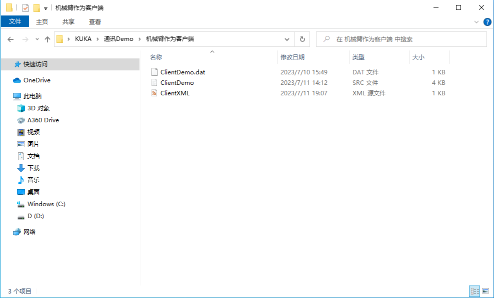
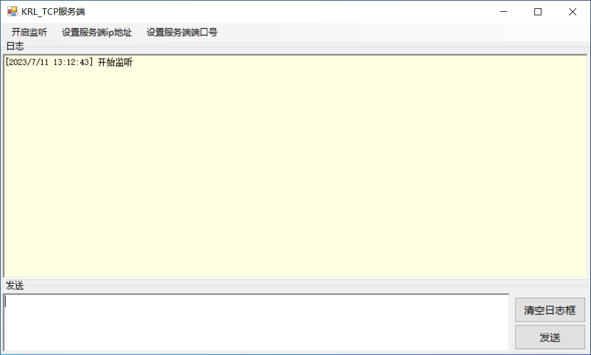
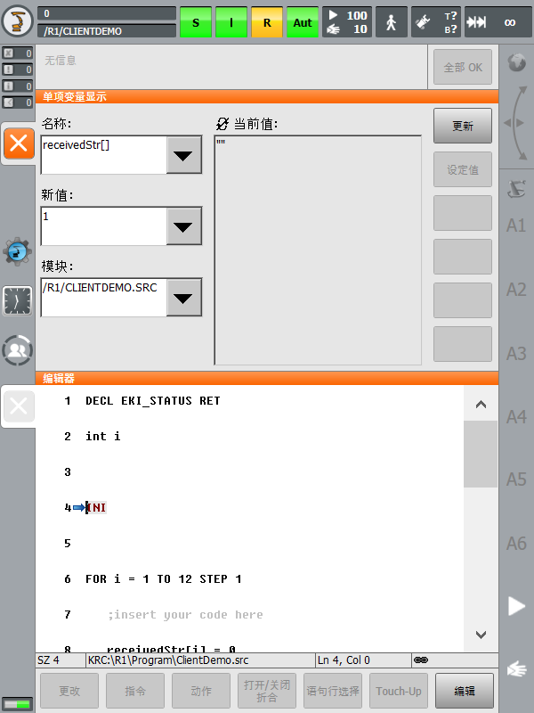
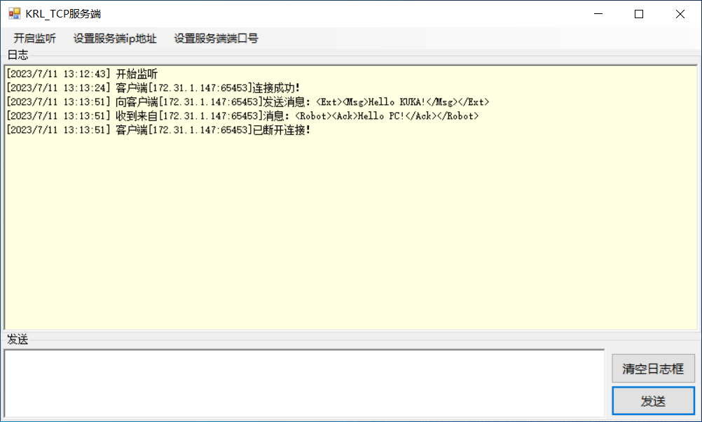
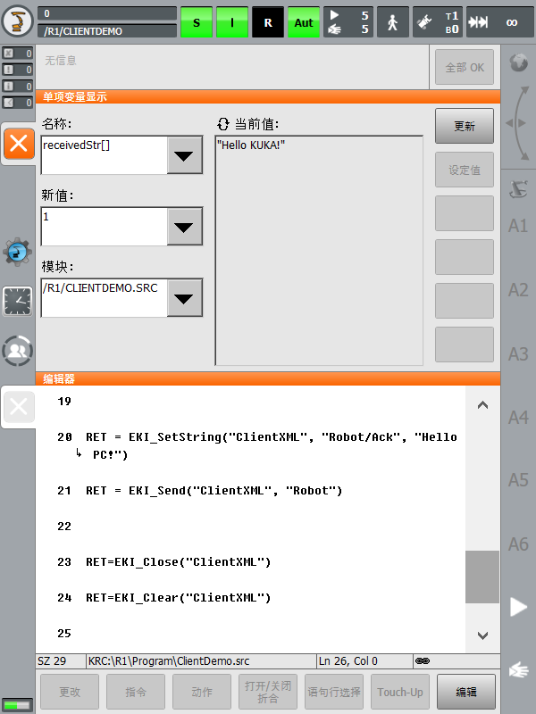

# 0、先决条件

在开始本教程之前，您需要确保您已经完成了[准备工作](./%E5%87%86%E5%A4%87%E5%B7%A5%E4%BD%9C.md)。

# 1、正文

1. 前往【机械臂作为客户端】文件夹，拷贝该目录下的三个文件至机器人控制系统： 

    > xml 配置文件存放目录：`C:\KRC\ROBOTER\Config\User\Common\EtherKRL`
    > 
    > src 和 dat 文件存放目录：`C:\KRC\ROBOTER\Program`

2. 运行 `KUKA_TCP_Server` 程序，配置服务端 IP 地址为 `172.31.1.160`，端口号为 `59152`。点击“开启监听”： 
3. 机械臂示教器**选定** `ClientDemo.src` 程序，打开**单项变量显示窗口**以[查看 `receivedStr[]` 全局变量的值](./%E5%87%86%E5%A4%87%E5%B7%A5%E4%BD%9C.md#AnchorPoint-ShowVariableValue)，随后点击示教器左侧的[**启动键**](https://zhuanlan.zhihu.com/p/425484118)以启动程序（必须要在服务端开始监听后再启动）： 
4. `KUKA_TCP_Server` 编辑发送符合配置文件中 XML 结构的消息给机器人控制系统，随后将会收到机器人控制系统回复的消息： 

    > 在 `ClientDemo.src` 中，程序在回复了消息后会关闭并删除通道，所以服务端会收到客户端断开连接的提示。

5. 在机械臂示教器上，我们可以查看 `KUKA_TCP_Server` 发来的数据：